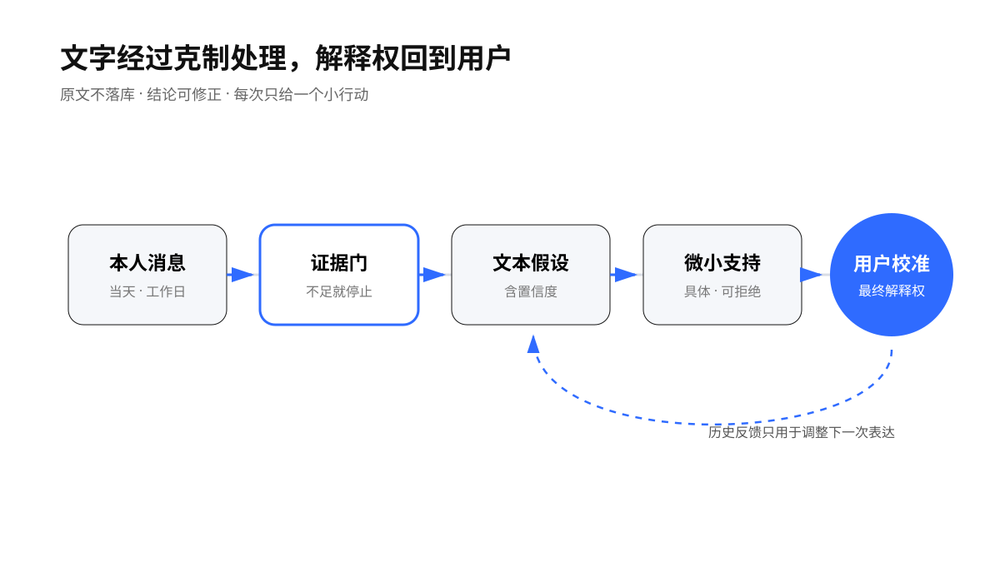
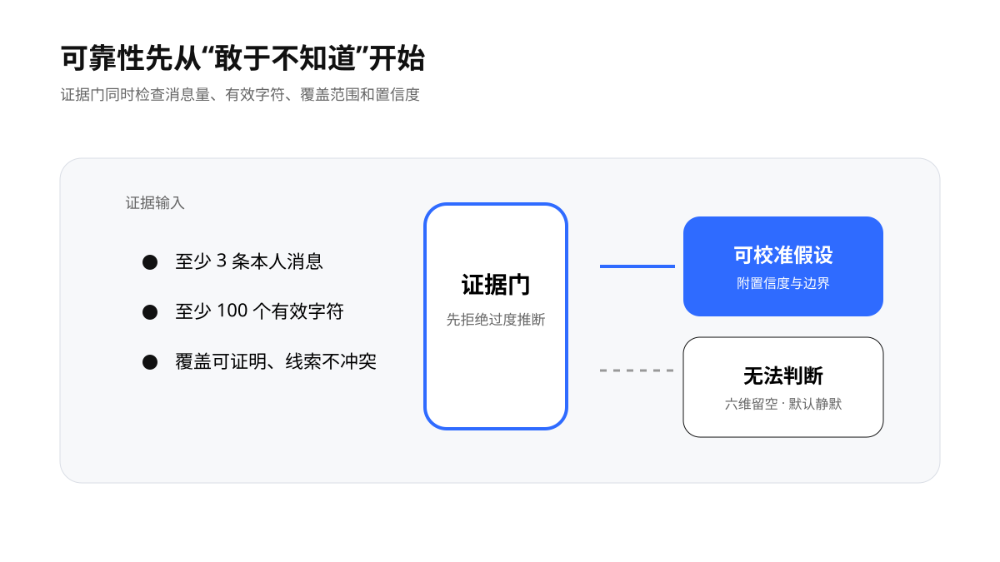
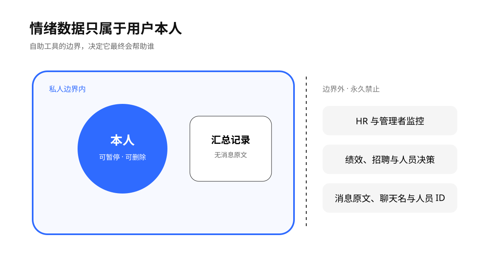

> “Humans should remain in control.” — [World Health Organization](https://www.who.int/news/item/28-06-2021-who-issues-first-global-report-on-artificial-intelligence-ai-in-health-and-six-guiding-principles-for-its-design-and-use)

# 情绪潮汐 Emotion Tide

一个面向飞书用户的私密自助 Skill。它在工作日 17:50 回顾用户本人当天发送的消息，生成带置信度的文本情绪假设、一句暖心话和一个低负担行动，写入仅本人使用的多维表格，并发送当天摘要图片。

它处于 Beta，提供自我觉察辅助，不提供心理诊断、治疗、测评或危机预测。用户自评拥有最终解释权。

<p align="center">
  
</p>

## 它解决什么

- 只读取当前用户本人发送的消息，只把结果发给本人。
- 非工作日静默跳过；调休工作日按官方日历执行。
- 消息原文只存在于运行时，不写入 Base、图片、日志或仓库。
- 输出主情绪、强度、置信度与六维文本状态；证据不足时拒绝判断。
- 识别本人主动添加的飞书消息表情；事务点赞只计互动，不直接等于愉悦。
- Base 仪表盘包含趋势、分布和六维雷达图。当天 PNG 保持轻量，不重复雷达。
- 用户可以校准“准确/部分准确/不准确”，选择支持偏好，或随时暂停。

## 可靠性边界

公开资料尚未证明任何现成模型能从中文工作聊天稳定识别一个人的真实情绪。工作套话、讽刺、转发、领域差异和个人表达习惯都会造成偏差。默认方案使用当前 Agent 的结构化语言模型生成假设，再由严格 schema 和证据门校验；模型名不写死。

<p align="center">
  
</p>

硬门槛包括：至少 3 条本人消息、至少 100 个有效字符、可证明的覆盖范围和不低于 0.55 的置信度。未通过时输出“无法判断/混合”，六维状态全部留空；当天没有本人消息时默认不打扰。表情不能单独跨过这道门。

可选中文情感分类器只能提供辅助信号。详细依据见 [模型选择](skill/emotion-tide/references/model-selection.md)。

## 安装

依赖：Python 3.10+、已完成用户身份授权的 `lark-cli`、Codex/Agent Skill 运行环境，以及可用的 SVG 转 PNG 工具。

```bash
git clone https://github.com/TongyiDai/emotion-tide.git
mkdir -p ~/.codex/skills
cp -R emotion-tide/skill/emotion-tide ~/.codex/skills/emotion-tide
cp emotion-tide/skill/emotion-tide/config.example.json ~/.config/emotion-tide/config.json
chmod 600 ~/.config/emotion-tide/config.json
```

编辑私有配置后运行：

```bash
export EMOTION_TIDE_CONFIG="$HOME/.config/emotion-tide/config.json"
python3 ~/.codex/skills/emotion-tide/scripts/doctor.py --live
```

首次对话可直接说：

> 请帮我安装“情绪潮汐”：使用我的飞书用户身份，创建一个私人 Base 和含六维雷达图的仪表盘；只分析我本人当天发送的消息；工作日 17:50 运行；非工作日静默跳过；先告诉我消息会在哪里处理，并等我同意后再启用。

配置中的 Base token、表 ID、接收人 ID 和飞书 profile 属于私密信息，禁止提交到 Git。年度工作日表应引用当地政府或其他权威来源；年份缺失时任务会关闭执行。

## 多维表格与仪表盘

Base 保存日期、汇总标签、证据计数、本人表情回应、六维文本信号和用户自愿反馈，不保存消息原文。仪表盘至少包含：记录天数、平均置信度、情绪强度趋势、文字表达活跃度趋势、本人表情回应趋势、主情绪分布、六维状态轮廓和方法说明。

六维雷达使用舒适度、精力、平静度、掌控感、连接感、清晰度六个字段。它表达文字中的相对信号，不能当作人格或心理测量。字段契约见 [输出 schema](skill/emotion-tide/references/output-schema.md)。

消息拉取结果可附带 reaction 的 `emoji_type`、操作者与添加时间。Skill 只保留当前用户主动添加的记录：点赞、Done、LGTM 等事务确认只进入表情活跃趋势；拥抱、感谢、庆祝等高置信语义最多提供 15% 的辅助权重；别人对用户消息的表情不参与判断。直接发送的贴纸若缺少稳定语义，只计次数。接口枚举见[飞书官方表情文档](https://open.feishu.cn/document/uAjLw4CM/ukTMukTMukTM/reference/im-v1/message-reaction/emojis-introduce)。

## 隐私和滥用边界

<p align="center">
  
</p>

本项目永久禁止团队情绪监控、员工画像、HR/管理者判断、绩效、招聘、晋升、纪律、保险、医疗和教育决策。欧盟委员会的 AI Act 指引将工作场所和教育机构中的情绪识别列为禁止用途，医疗或安全例外另论；项目在所有地区都采用同样窄的自助边界。

首次启用必须取得文本处理同意。云端 Agent 可能把去标识后的消息发送给当前模型提供方；要求完全本地处理时，应配置 `local_only` 和本地模型。权限状态无法可靠读取时，部署者必须让用户在飞书界面确认，不能宣称“仅本人可见”。

详细规则见 [安全与支持](skill/emotion-tide/references/safety-and-support.md) 和 [Security Policy](SECURITY.md)。

## 为什么可能真的有帮助

产品目标很窄：帮助用户注意、命名、修正自己的感受，并把下一步缩小。研究更支持情绪语言脚手架和主动自我描述；单纯反复监测的帮助有限。因此每次只给一个具体、可拒绝的小行动，并邀请用户校准。若最近 10 次里至少 3 次帮助评分不高，或连续反馈“不准确”，Skill 会建议降频、关闭推断或暂停。

参考：[情绪语言脚手架研究](https://pubmed.ncbi.nlm.nih.gov/39048111/)、[移动即时干预随机试验](https://pubmed.ncbi.nlm.nih.gov/38640015/)。这些研究支持设计方向，不证明本项目已有临床效果。

## 验证

```bash
python3 -m unittest discover -s tests -v
python3 skill/emotion-tide/scripts/validate_analysis.py examples/analysis.sample.json
python3 skill/emotion-tide/scripts/render_dashboard.py --output /tmp/emotion-tide.svg < examples/analysis.sample.json
```

示例数据完全虚构。测试覆盖：工作日/调休日门禁、零消息语义、弱证据拒答、多余字段拒绝、本人 reaction 过滤与去标识聚合、SVG 裁切和仪表盘雷达契约。

## 贡献原则

优先欢迎：更强的隐私验证、跨地区权威工作日日历适配、可解释的拒答评估、用户可控的本地模型路径。不会接受监控他人、危机预测或人员决策能力。

MIT License。
